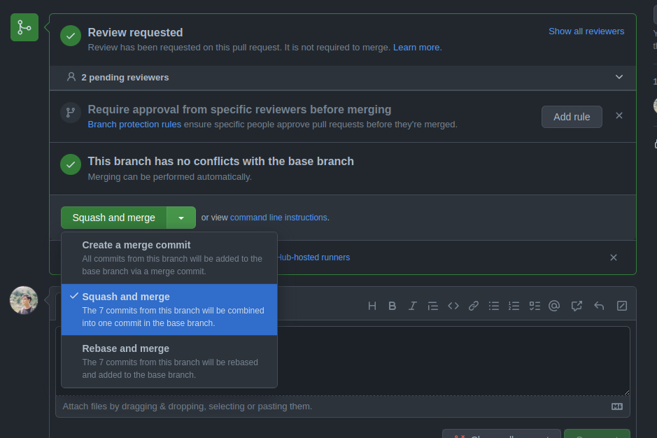

# Getting started

## Setup

- Create conda environment (suggest 3.10)

  ```shell
  conda create -n kotaemon python=3.10
  conda activate kotaemon
  ```

- Clone the repo

  ```shel
  git clone git@github.com:Cinnamon/kotaemon.git
  cd kotaemon
  ```

- Install all

  ```shell
  cd libs/kotaemon
  pip install -e ".[dev]"
  ```

- Pre-commit

  ```shell
  pre-commit install
  ```

- Test

  ```shell
  pytest tests
  ```

## Credential sharing

This repo uses [git-secret](https://sobolevn.me/git-secret/) to share credentials, which
internally uses `gpg` to encrypt and decrypt secret files.

This repo uses `python-dotenv` to manage credentials stored as environment variable.
Please note that the use of `python-dotenv` and credentials are for development
purposes only. Thus, it should not be used in the main source code (i.e. `kotaemon/` and `tests/`), but can be used in `examples/`.

### Install git-secret

Please follow the [official guide](https://sobolevn.me/git-secret/installation) to install git-secret.

For Windows users, see [For Windows users](#for-windows-users).

For users who don't have sudo privilege to install packages, follow the `Manual Installation` in the [official guide](https://sobolevn.me/git-secret/installation) and set `PREFIX` to a path that you have access to. And please don't forget to add `PREFIX` to your `PATH`.

### Gaining access to credientials

In order to gain access to the secret files, you must provide your gpg public file to anyone who has access and ask them to ask your key to the keyring. For a quick tutorial on generating your gpg key pair, you can refer to the `Using gpg` section from the [git-secret main page](https://sobolevn.me/git-secret/).

### Decrypt the secret file

The credentials are encrypted in the `.env.secret` file. To print the decrypted content to stdout, run

```shell
git-secret cat [filename]
```

Or to get the decrypted `.env` file, run

```shell
git-secret reveal [filename]
```

### For Windows users

git-secret is currently not available for Windows, thus the easiest way is to use it in WSL (please use the latest version of WSL2). From there you have 2 options:

1. Using the gpg of WSL.

   This is the most straight-forward option since you would use WSL just like any other unix environment. However, the downside is that you have to make WSL your main environment, which means WSL must have write permission on your repo. To achieve this, you must either:

   - Clone and store your repo inside WSL's file system.
   - Provide WSL with necessary permission on your Windows file system. This can be achieve by setting `automount` options for WSL. To do that, add these content to `/etc/wsl.conf` and then restart your sub-system.

     ```shell
     [automount]
     options = "metadata,umask=022,fmask=011"
     ```

     This enables all permissions for user owner.

2. Using the gpg of Windows but with git-secret from WSL.

   For those who use Windows as the main environment, having to switch back and forth between Windows and WSL will be inconvenient. You can instead stay within your Windows environment and apply some tricks to use `git-secret` from WSL.

   - Install and setup `gpg` on Windows.
   - Install `git-secret` on WSL. Now in Windows, you can invoke `git-secret` using `wsl git-secret`.
   - Alternatively you can setup alias in CMD to shorten the syntax. Please refer to [this SO answer](https://stackoverflow.com/a/65823225) for the instruction. Some recommended aliases are:

     ```bat
     @echo off

     :: Commands
     DOSKEY ls=dir /B $*
     DOSKEY ll=dir /a $*
     DOSKEY git-secret=wsl git-secret $*
     DOSKEY gs=wsl git-secret $*
     ```

     Now you can invoke `git-secret` in CMD using `git-secret` or `gs`.

     - For Powershell users, similar behaviours can be achieved using `Set-Alias` and `profile.ps1`. Please refer this [SO thread](https://stackoverflow.com/questions/61081434/how-do-i-create-a-permanent-alias-file-in-powershell-core) as an example.

# PR guideline

## Common conventions

- Review should be done as soon as possible (within 2 business days).
- PR title: [ticket] One-line description (example: [AUR-385, AUR-388] Declare BaseComponent and decide LLM call interface).
- [Encouraged] Provide a quick description in the PR, so that:
  - Reviewers can quickly understand the direction of the PR.
  - It will be included in the commit message when the PR is merged.

## Environment caching on PR

- To speed up CI, environments are cached based on the version specified in `__init__.py`.
- Since dependencies versions in `setup.py` are not pinned, you need to pump the version in order to use a new environment. That environment will then be cached and used by your subsequence commits within the PR, until you pump the version again
- The new environment created during your PR is cached and will be available to others once the PR is merged.
- If you are experimenting with new dependencies and want a fresh environment every time, add `[ignore cache]` in your commit message. The CI will create a fresh environment to run your commit and then discard it.
- If your PR include updated dependencies, the recommended workflow would be:
  - Doing development as usual.
  - When you want to run the CI, push a commit with the message containing `[ignore cache]`.
  - Once the PR is final, pump the version in `__init__.py` and push a final commit not containing `[ignore cache]`.

Examples: https://github.com/Cinnamon/kotaemon/pull/2

## Merge PR guideline

- Use squash and merge option
- 1st line message is the PR title.
- The text area is the PR description.




## Develop pipelines

- Nodes
- Params
- Run function

```
from kotaemon.base import BaseComponent

class Pipeline(BaseComponent):
   llm: AzureOpenAIEmbedding
   doc_store: BaseDocumentStore

   def run(self, input1, input2) -> str:
      input = input1 + input2
      output = self.llm(input)
      self.doc_store.add(output)
      return output

pipeline = Pipeline(llm=AzureOpenAILLM(), doc_store=InMemoryDocstore())
output = pipeline("this is text1", "this is text2")
```
